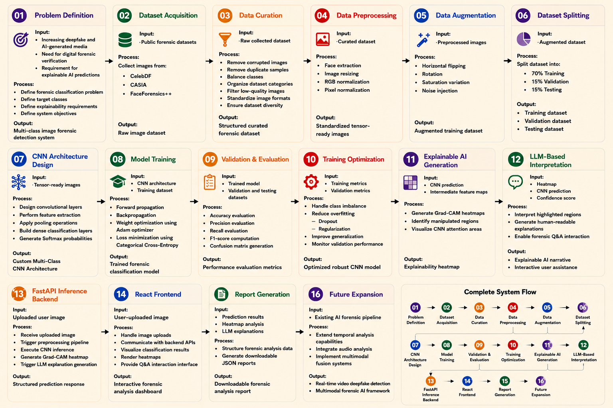

# Media Integrity Checker

An AI-powered application for detecting manipulated media using deep learning. This project combines a Next.js frontend with a FastAPI backend to analyze images and videos for signs of manipulation.

## Features

- Image and video manipulation detection
- Real-time analysis with progress tracking
- Explainable AI with GradCAM visualizations
- User authentication (Google OAuth)
- Analysis history and reporting
- Interactive UI with detailed results

## End-to-End AI Pipeline

<p align="center">
  
</p>

This diagram illustrates the complete workflow of the Media Integrity Checker, including data collection, preprocessing, CNN model training, explainable AI generation, LLM-powered interpretation, backend inference services, frontend visualization, and forensic report generation.

## Tech Stack

### Frontend

- Next.js 15.3.5 with Turbopack
- React 19
- TypeScript
- Tailwind CSS
- Framer Motion
- Radix UI Components

### Backend

- FastAPI
- TensorFlow 2.10.0
- Keras 2.10.0
- OpenCV
- Python 3.x

## Prerequisites

Before running this application, ensure you have the following installed:

- **Node.js** (v18 or higher) and npm
- **Python** (v3.8 - v3.10 recommended for TensorFlow 2.10 compatibility)
- **Git**

## Installation

### 1. Clone the Repository

```bash
git clone <repository-url>
cd remix-of-asacai-media-integrity-ui
```

### 2. Install Frontend Dependencies

```bash
npm install
```

### 3. Install Backend Dependencies

```bash
cd backend
pip install -r requirements.txt
cd ..
```

**Note:** It's recommended to use a virtual environment:

```bash
# Create virtual environment
python -m venv venv

# Activate virtual environment
# On Windows:
venv\Scripts\activate
# On macOS/Linux:
source venv/bin/activate

# Install dependencies
pip install -r backend/requirements.txt
```

### 4. Verify Model File

Ensure the model file `first_try(baseline).h5` exists in the project root directory. This file is required for the AI analysis.

### 5. Configure Environment Variables

The `.env` file should already be present with the necessary configuration. If not, create one with:

```env
TURSO_CONNECTION_URL=<your-database-url>
BETTER_AUTH_SECRET=<your-auth-secret>
GOOGLE_CLIENT_ID=<your-google-client-id>
GOOGLE_CLIENT_SECRET=<your-google-client-secret>
TURSO_AUTH_TOKEN=<your-database-token>
```

## Running the Application

### Option 1: Using the Batch Script (Windows)

The easiest way to start both servers:

```bash
start-servers.bat
```

This will:

- Check for the model file
- Start the backend server on http://localhost:8000
- Start the frontend server on http://localhost:3000
- Open both in separate terminal windows

### Option 2: Manual Start

#### Start Backend Server

```bash
cd backend
python start.py
```

The backend will be available at:

- API: http://localhost:8000
- API Documentation: http://localhost:8000/docs

#### Start Frontend Server

In a new terminal:

```bash
cd Frontend
npm run dev
```

The frontend will be available at:

- Application: http://localhost:3000

## Usage

1. Open your browser and navigate to http://localhost:3000
2. Sign in using Google authentication (optional)
3. Upload an image or video file for analysis
4. Wait for the AI model to process the media
5. View the results including:
   - Authenticity score
   - Manipulation probability
   - GradCAM heatmap visualization
   - Detailed analysis report

## Project Structure

```
remix-of-asacai-media-integrity-ui/
├── backend/                    # FastAPI backend
│   ├── main.py                # Main API endpoints
│   ├── start.py               # Startup script
│   └── requirements.txt       # Python dependencies
├── src/                       # Next.js frontend source
│   ├── app/                   # App router pages
│   ├── components/            # React components
│   └── lib/                   # Utility functions
├── public/                    # Static assets
├── first_try(baseline).h5     # AI model file
├── .env                       # Environment variables
├── package.json               # Node.js dependencies
├── start-servers.bat          # Windows startup script
└── README.md                  # This file
```

## API Endpoints

### Backend API (http://localhost:8000)

- `POST /analyze` - Upload and analyze media file
- `GET /health` - Health check endpoint
- `GET /docs` - Interactive API documentation

## Troubleshooting

### Backend Issues

**Model file not found:**

```
ERROR: Model file 'first_try(baseline).h5' not found!
```

Solution: Ensure the model file is in the project root directory.

**Missing dependencies:**

```
❌ Missing dependency: tensorflow
```

Solution: Install backend dependencies:

```bash
pip install -r backend/requirements.txt
```

**TensorFlow compatibility:**
If you encounter TensorFlow installation issues, ensure you're using Python 3.8-3.10. TensorFlow 2.10 may not support newer Python versions.

### Frontend Issues

**Port already in use:**
If port 3000 is already in use, you can specify a different port:

```bash
npm run dev -- -p 3001
```

**Dependencies not installed:**

```bash
npm install
```

## Development

### Running Tests

```bash
# Frontend tests
npm test

# Backend tests
cd backend
python -m pytest
```

### Building for Production

```bash
# Build frontend
npm run build
npm start

# Backend runs the same in production
cd backend
python start.py
```

## Additional Documentation

- [Integration Guide](INTEGRATION_README.md) - Detailed integration documentation
- [Model Integration Guide](MODEL_INTEGRATION_GUIDE.md) - AI model integration details
- [Explainable AI System](EXPLAINABLE_AI_SYSTEM.md) - GradCAM and XAI implementation

## License

This project is private and proprietary.

## Support

For issues or questions, please contact the development team or create an issue in the repository.
